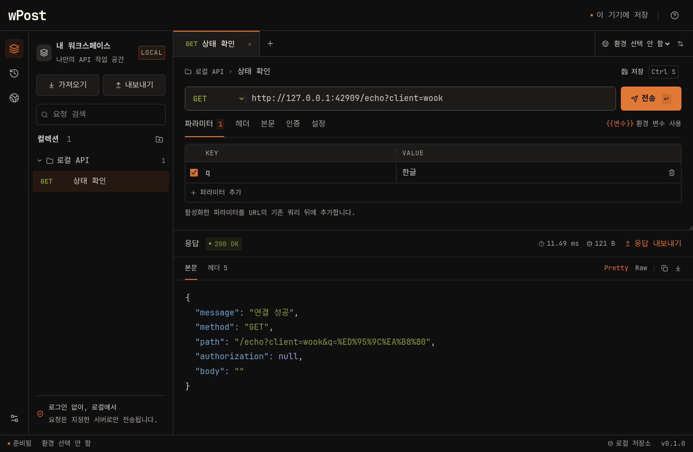

# wPost

Windows x64에서 사용하는 로컬 API 클라이언트입니다. 요청 작성부터 응답 확인, 컬렉션 관리, 히스토리 백업까지 한국어 화면으로 제공합니다.

**현재 버전: 0.1.0** · 제작자: **Hyunwook Park (parkhw328@gmail.com)**

wShell과 주황색 `w` 아이콘·Flexoki Dark 테마를 공유합니다. 영문은 **JetBrains Mono**, 한글은 **Noto Sans KR**를 앱에 포함해 사용합니다. 일반 UI는 16px, URL·코드는 17px, 보조 정보는 최소 14px입니다. [브랜딩 기준과 호환성](docs/branding.md)을 참고하세요.



## 시작하기

개발 환경: Node.js **24 LTS 이상**, npm, Git. Windows 빌드 대상은 **x64**입니다.

```bash
npm ci
npm run dev
```

로컬 API를 바로 시험하려면 별도 터미널에서 실행합니다.

```bash
npm run demo:server
```

앱에서 `http://127.0.0.1:4545/echo`를 입력하고 **전송**하세요. 외부 서비스를 사용하지 않고 메서드·헤더·본문을 확인할 수 있습니다. `Ctrl + Enter`는 전송, `Ctrl + S`는 요청 저장입니다.

## 현재 기능

- GET, POST, PUT, PATCH, DELETE, HEAD, OPTIONS 및 중복 키를 지원하는 쿼리·헤더 편집.
- JSON, 텍스트, `application/x-www-form-urlencoded` 본문.
- Bearer Token / Basic Auth, `{{baseUrl}}` 형태의 환경 변수.
- 컬렉션에 요청 저장, 여러 탭, 검색, 요청 취소·시간 제한·리다이렉트 설정.
- 응답 상태·소요 시간·크기·헤더·JSON Pretty/Raw, 응답 복사와 원본 바이트 내보내기. JSON 정렬은 큰 정수·소수 표기·중복 키를 그대로 보존합니다.
- 로컬 SQLite 히스토리와 요청 재열기. 기록은 자동 삭제하지 않으며 100건씩 불러옵니다.
- 전체 백업, 히스토리, 단일 요청·응답 JSON 가져오기/내보내기.
- Postman Collection v2.0/v2.1 가져오기 및 v2.1 내보내기.

## 데이터 가져오기와 내보내기

사이드바의 **가져오기**에서 JSON을 선택합니다. 형식·건수·지원하지 않는 항목을 확인한 후 적용합니다. 기존 데이터는 유지하고 컬렉션·환경·요청을 새 ID로 추가합니다. 동일한 히스토리는 중복 저장하지 않습니다. 어느 항목이라도 적용에 실패하면 가져오기 전체를 되돌립니다.

**내보내기**에서 전체 백업 또는 히스토리를 선택합니다. 응답 영역에서는 단일 요청·응답 백업이나 원본 본문 파일을 저장할 수 있습니다. 원본 본문 파일은 JSON 백업과 달리 앱으로 다시 가져오는 형식은 아닙니다.

| 형식                                  | 보존 범위                                                                  |
| ------------------------------------- | -------------------------------------------------------------------------- |
| wPost JSON (`schemaVersion: 1`)       | 요청, 환경, 컬렉션, 요청·응답 기록, 원본 응답 바이트, 시간·크기            |
| Postman Collection v2.0/v2.1 가져오기 | 요청, 폴더 경로, 쿼리·헤더, raw/urlencoded 본문, Bearer/Basic, 컬렉션 변수 |
| Postman Collection v2.1 내보내기      | 저장한 요청, 컬렉션 폴더, 현재 활성 환경의 변수                            |

Postman 중첩 폴더는 요청 이름에 경로로 보존합니다. 스크립트는 실행하거나 가져오지 않으며 미리보기에 알립니다. multipart·파일 본문, Postman 경로 변수, OAuth 등 미지원 인증은 가져오기를 중단합니다. Postman 파일에는 wPost의 히스토리·타임아웃·리다이렉트 설정이 보존되지 않으므로 전체 이전은 wPost 백업을 사용하세요.

## 저장 위치와 한도

앱의 **정보** 화면에서 실제 데이터 경로를 확인할 수 있습니다. Windows 기본 경로는 `%APPDATA%/Wook Post/wook-post.sqlite`이며 설치 파일과 분리됩니다. wPost로 이름을 바꾼 뒤에도 기존 데이터를 이어 쓰도록 이 경로를 유지합니다. SQLite WAL 파일이 있을 수 있으므로 실행 중인 DB 파일을 직접 복사하기보다 앱의 백업 기능을 사용하세요.

- 토큰·비밀번호·쿠키·응답은 **평문**으로 로컬 저장소와 백업에 포함될 수 있습니다.
- 실행 기록에는 전송 시 치환한 환경 변수 값이 저장되어 환경 변경 후에도 같은 요청을 재사용할 수 있습니다.
- 요청 본문은 1 MiB, 수신 응답은 5 MiB까지입니다. 큰 응답은 부분 저장 사실을 화면과 백업에 표시합니다.
- 화면 본문 미리보기는 100,000자까지이며 저장된 원본은 파일로 내보낼 수 있습니다.
- 워크스페이스는 20 MiB, 백업 한 파일은 100 MiB / 히스토리 50,000건까지 지원합니다. 한도 초과 시 오류로 알리고 기존 데이터는 유지합니다.
- TLS 인증서를 검증합니다. 응답 HTML은 실행하지 않으며 클라우드 동기화·자동 업로드는 없습니다.

## Windows 설치 파일 만들기

Windows x64 로컬 터미널에서 실행하세요.

```powershell
npm ci
npm run dist:win
```

타입·포맷·테스트·번들 빌드 후 `release/wPost-0.1.0-x64-Setup.exe`를 생성하도록 구성했습니다. NSIS 기반 설치 마법사에서 설치 경로를 선택할 수 있고 바탕화면·시작 메뉴 바로가기를 제공합니다. 상용 InstallShield 프로젝트 파일은 사용하지 않습니다.

현재 Linux 개발 환경에서 Windows 설치 과정은 검증하지 않았습니다. [배포 체크리스트](docs/releasing.md)로 실제 Windows 설치·업그레이드·제거를 확인해야 합니다. 코드 서명은 아직 구성하지 않았습니다.

2026-10-08에 `wPost 0.1.0` 소스로 Windows x64 설치 파일을 로컬 Docker에서 생성했습니다. 작업 공간의 `release/wPost-0.1.0-x64-Setup.exe`와 `.exe.sha256` 파일을 사용할 수 있습니다. [빌드 기록과 체크섬](docs/builds/v0.1.0-windows.md)을 참고하세요. 설치 파일 자체는 Git에 포함하지 않습니다.

## 개발 명령

| 명령               | 용도                           |
| ------------------ | ------------------------------ |
| `npm run dev`      | Electron 개발 실행             |
| `npm run build`    | 타입 검사와 프로덕션 번들 생성 |
| `npm start`        | 빌드된 데스크톱 앱 실행        |
| `npm test`         | 통신·저장·변환 테스트          |
| `npm run test:e2e` | 실제 Electron 창으로 기능 검증 |
| `npm run check`    | 타입·Prettier·테스트 확인      |
| `npm run format`   | 소스·문서 포맷 정리            |
| `npm run dist:win` | Windows x64 로컬 설치기 빌드   |

디스플레이 없는 Linux 테스트 환경에서는 `xvfb-run -a npm run test:e2e`를 사용합니다. 루트 컨테이너의 테스트 실행에만 샌드박스 예외를 적용하며 일반 앱 실행 설정에는 적용하지 않습니다.

## 구조와 작업 기록

```text
src/main/       HTTP 통신, SQLite, 파일 변환, Electron 창 및 IPC
src/preload/    화면에 공개하는 제한된 데스크톱 API
src/renderer/   React 화면과 스타일
src/shared/     데이터 타입과 런타임 검증 스키마
tests/          실제 HTTP·저장·파일 변환 및 Electron 테스트
scripts/        Windows 로컬 빌드와 테스트용 API 서버
build/          wShell과 공유하는 앱·설치기 아이콘
licenses/       아이콘·테마·번들 글꼴 라이선스
resources/      사용자 요구사항 원본
rules/rules.md  작업 원칙과 진행 기록
docs/           제품 조사와 배포 절차
```

TypeScript strict 모드, 2칸 들여쓰기, Prettier를 사용합니다. 컴포넌트는 PascalCase, 함수·변수는 camelCase, 테스트는 `*.test.ts`와 E2E의 `*.spec.ts`로 작성합니다. 테스트는 외부 API 대신 로컬 서버와 임시 DB를 사용합니다.

[작업 기록](rules/rules.md) · [변경 이력](CHANGELOG.md) · [경쟁 제품 조사](docs/benchmark.md) · [버전·배포 절차](docs/releasing.md)

공유 디자인 자산의 출처와 라이선스는 [디자인 자산 고지](THIRD_PARTY_NOTICES.md)에 기록합니다. 설치된 앱에서도 **앱 정보 → 디자인 자산 라이선스**로 확인할 수 있습니다.

`0.1.0`의 [전체 점검 결과와 수정 내역](docs/reviews/v0.1.0.md)을 확인할 수 있습니다.
